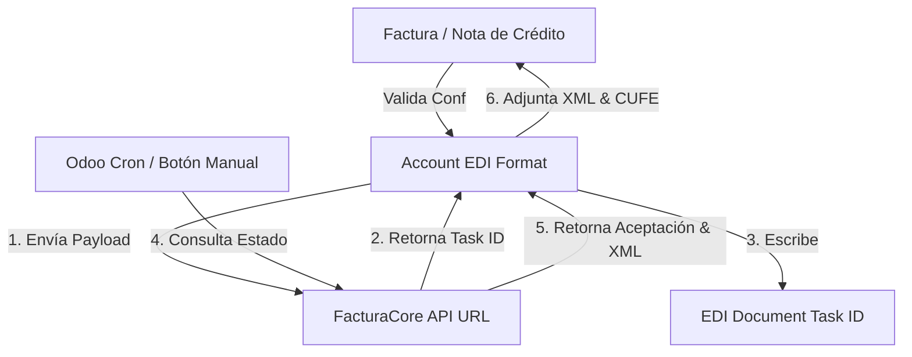

# FacturaCore Odoo Connector 🔌🇨🇴

> [!NOTE]
> **FacturaCore Odoo Connector** es un módulo ligero para **Odoo 18.0** que actúa como puente de facturación electrónica. Implementa el flujo EDI nativo de Odoo para extraer datos contables de facturas y notas de crédito, y transmitirlos al microservicio centralizado **FacturaCore API** para su respectiva firma y envío a la DIAN.

---

## 📂 Estructura del Submódulo

El submódulo se compone de los siguientes directorios y archivos:

- [facturacore-connector/](file:///c:/Users/jupar/Documents/UNIR/facturacore/connector/facturacore-connector/): Directorio principal del módulo Odoo.
- [LICENSE](file:///c:/Users/jupar/Documents/UNIR/facturacore/connector/LICENSE): Licencia del proyecto.
- [.gitignore](file:///c:/Users/jupar/Documents/UNIR/facturacore/connector/.gitignore): Archivos ignorados por Git.

---

## 🚀 Características Clave

- **Flujo EDI Nativo de Odoo**: Utiliza la clase `account.edi.format` de Odoo para gestionar envíos automáticos y asíncronos.
- **Conexión API Segura**: Permite configurar la API Key y la URL del microservicio directamente desde los ajustes contables de la compañía.
- **Asincronía Completa**:
  - Encola las facturas contables obteniendo un `task_id`.
  - Verifica el estado del documento mediante el Cron de Odoo en segundo plano.
  - No bloquea al usuario durante la firma o respuesta de la DIAN.
- **Descarga e Integración de XML**: Una vez que la DIAN aprueba la factura, el conector recupera el XML final (`ApplicationResponse`) y lo adjunta automáticamente al asiento contable de Odoo, actualizando el estado DIAN y asignando el **CUFE** correspondiente.
- **Consultas Manuales**: Acción de un solo botón (`button_check_dian_status_manual`) en la vista de facturas para actualizar el estado del documento al instante sin esperar la ejecución del Cron.

---

## 🛠️ Arquitectura del Conector

El módulo Odoo se organiza bajo el siguiente flujo:

- [__manifest__.py](file:///c:/Users/jupar/Documents/UNIR/facturacore/connector/facturacore-connector/__manifest__.py): Metadatos, dependencias del módulo (`account_edi`), y definición de archivos xml de vistas y datos.
- **`models/`**:
  - [account_move.py](file:///c:/Users/jupar/Documents/UNIR/facturacore/connector/facturacore-connector/models/account_move.py): Extiende el modelo `account.move` para añadir los campos de Estado DIAN, CUFE, el constructor del payload JSON (`_build_facturacore_json_payload`) y el botón de verificación manual.
  - [account_edi_format.py](file:///c:/Users/jupar/Documents/UNIR/facturacore/connector/facturacore-connector/models/account_edi_format.py): Lógica central que implementa los métodos `_post_invoice_edi` y gestiona las peticiones `POST` (encolar) y `GET` (verificar estado).
  - [res_company.py](file:///c:/Users/jupar/Documents/UNIR/facturacore/connector/facturacore-connector/models/res_company.py): Añade los campos de configuración a nivel compañía (URL, API Key, certificado PFX y clave).
- **`views/`**:
  - [res_config_settings_views.xml](file:///c:/Users/jupar/Documents/UNIR/facturacore/connector/facturacore-connector/views/res_config_settings_views.xml): Interfaz gráfica de configuración contable en Odoo para ingresar credenciales de la API.

---

## ⚙️ Configuración en Odoo

Una vez instalado el módulo en tu base de datos de Odoo 18.0:

1. Ve a **Contabilidad** -> **Configuración** -> **Ajustes**.
2. Desplázate hasta la sección **FacturaCore API**.
3. Configura los siguientes parámetros:
   - **URL de la API**: Endpoint del proxy/servidor de FastAPI (ej: `http://localhost:8000` o dominio seguro).
   - **API Key**: Token secreto configurado en el microservicio.
   - **Ambiente DIAN**: Elige entre `Pruebas (Sandbox/Piloto)`, `Habilitación (Set de Pruebas DIAN)`, o `Producción`.
   - **Nombre del archivo PFX**: Nombre del archivo del certificado digital alojado en el microservicio (ej: `empresa_a.pfx`).
   - **Contraseña PFX**: Contraseña del certificado para desencriptar el almacenamiento criptográfico.

---

## 📋 Requisitos e Instalación

- **Versión de Odoo**: 18.0 (Soporta ediciones Community y Enterprise).
- **Dependencias core**: Módulo `account_edi` (instalado automáticamente al depender de él).
- **Instalación**:
  1. Copia la carpeta `facturacore-connector` al directorio de `addons` de tu servidor Odoo.
  2. Actualiza la lista de aplicaciones en modo desarrollador.
  3. Busca `FacturaCore API - Conector Ligero de Facturación Electrónica` e instálalo.
